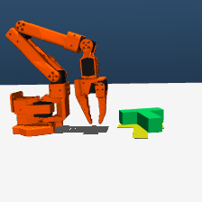
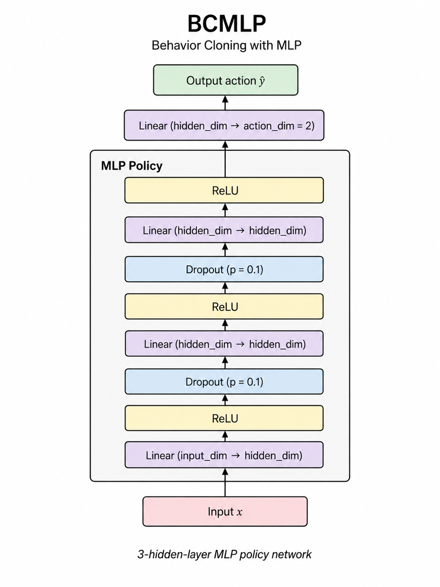
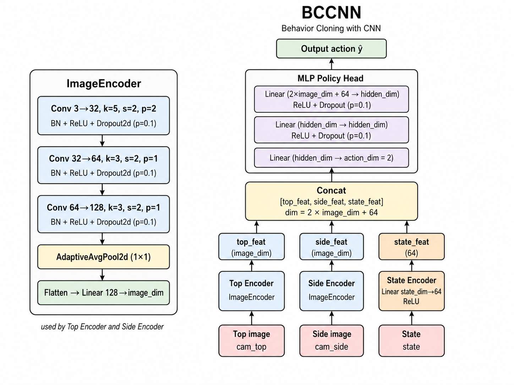
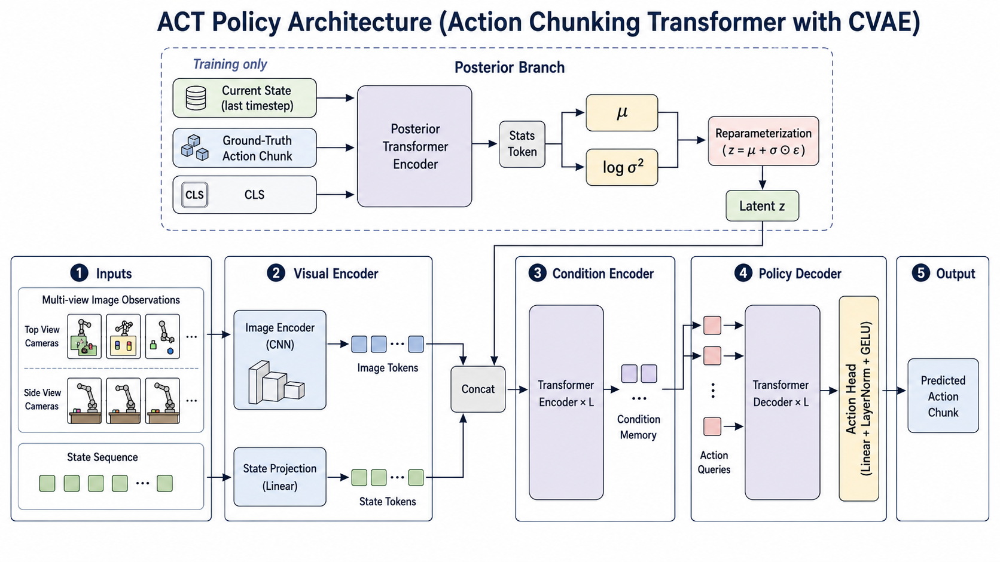
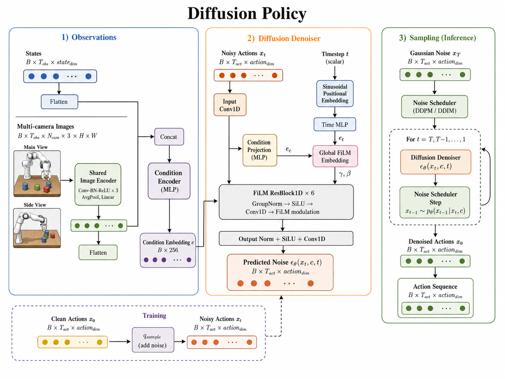

# MyPushT



MyPushT 是一个基于 MuJoCo 和 SO-ARM100 的 PushT 模仿学习 benchmark。项目目标不是只训练一个策略，而是把具身智能任务整理成一条可复现的工程闭环：环境仿真、手柄遥操作采集、LeRobot 数据转换、策略训练、统一评估和结果汇总。

当前版本聚焦 4 类策略：BC-MLP、BC-CNN、ACT 和 Diffusion Policy。

## 目录

- [项目亮点](#项目亮点)
- [项目结构](#项目结构)
- [环境要求](#环境要求)
- [快速开始](#快速开始)
- [数据采集与转换](#数据采集与转换)
- [策略说明](#策略说明)
- [策略训练](#策略训练)
- [统一评估](#统一评估)
- [策略效果视频](#策略效果视频)
- [动作与数据约定](#动作与数据约定)
- [常用命令入口](#常用命令入口)
- [故障排查](#故障排查)
- [License](#license)

## 项目亮点

- 提供基于 MuJoCo 的SO-ARM100 PushT 环境
- 支持手柄遥操作采集，根据 `configs/controller_mapping.json` 管理按键、摇杆、采样频率和工作空间。
- 支持 raw episode 转换为 LeRobotDataset，便于统一训练 BC、ACT、Diffusion Policy。
- 内置 BC-MLP、BC-CNN、ACT、Diffusion Policy 策略实现。
- 提供 normal / wide 两种评估 split，并统一输出 per-episode CSV、summary JSON 和聚合对比表。

## 项目结构

```text
MyEmbodied/
├── configs/
│   └── controller_mapping.json     # 手柄遥操作映射
├── docs/
│   ├── env_image/                  # so100环境图片
│   ├── model_diagrams/             # 四类策略模型说明图
│   ├── videos/                     # 四类策略评估视频
│   └── results/
│       └── policy_comparison.csv   # 当前策略评估
├── src/
│   └── mypusht/
|       ├── assets/
│           └── envs/               # MuJoCo XML、STL 模型资源
│       ├── data/                   # raw episode 保存、LeRobot 转换、序列数据集
│       ├── envs/                   # SimplePushT 与 SO100 PushT 环境
│       ├── evaluation/             # 策略适配器、统一评估、结果聚合
│       ├── policies/               # Heuristic、BC、ACT、Diffusion Policy
│       ├── teleop/                 # 手柄控制、预览、遥操作采集
│       └── training/               # 各策略训练入口
├── environment.yml                 # Conda 环境
├── pyproject.toml                  # Python 包配置与命令行入口
├── README.md
└── LICENSE
```

默认输出目录由 `src/mypusht/paths.py` 管理：

| 用途           | 默认路径                             |
| -------------- | ------------------------------------ |
| raw episodes   | `outputs/data/raw_episodes/`         |
| LeRobot 数据集 | `outputs/data/lerobot_dataset/`      |
| 训练缓存       | `outputs/cache/`                     |
| 模型权重       | `outputs/models/` 或 `assets/model/` |
| 评估结果       | `outputs/eval/`                      |

## 环境要求

- Python `>=3.10,<3.12`
- Conda 或 Mamba
- MuJoCo `>=3.1`
- PyTorch `>=2.2`
- LeRobot `>=0.5`
- 可选：CUDA 12.1、pygame 手柄支持、wandb 日志

如果没有 NVIDIA GPU，可以把 `environment.yml` 里的 `pytorch-cuda=12.1` 换成适合本机的 CPU PyTorch 安装方式。

## 快速开始

所有命令默认在项目根目录执行：

```bash
conda env create -f environment.yml
conda activate mypusht
pip install -e ".[logging,teleop]"
```

做一次最小环境检查：

```bash
python -m compileall src
mypusht-convert --help
mypusht-train --help
mypusht-eval --help
```

预期现象：

- `compileall` 能完成 Python 语法检查。
- `--help` 命令能正常打印 CLI 参数。

## 数据采集与转换

### 1. 检查手柄映射

手柄配置在 `configs/controller_mapping.json`：

```json
{
    "axis_left_x": 0,
    "axis_left_y": 1,
    "button_record": 1,
    "button_reset": 5,
    "button_exit": 3,
    "button_discard": 0,
    "deadzone": 0.1,
    "move_speed": 0.15,
    "fps": 10,
    "workspace_x": [0.05, 0.5],
    "workspace_y": [-0.25, 0.25]
}
```

### 2. 遥操作采集 raw episodes

```bash
mypusht-collect --max_seconds 60 --preview_scale 2
```

采集逻辑：

- 按 record 按钮开始录制，再按一次保存 episode。
- 按 reset 重置环境。
- 按 discard 丢弃当前录制。
- 按 exit 退出采集程序。
- raw episode 默认保存到 `outputs/data/raw_episodes/episode_XXXX.npz`。

单个 raw episode 主要字段如下：

| 字段          | 形状               | 含义                    |
| ------------- | ------------------ | ----------------------- |
| `cam_top`     | `(T, 224, 224, 3)` | 顶视相机图像            |
| `cam_side`    | `(T, 224, 224, 3)` | 侧视相机图像            |
| `state`       | `(T, 5)`           | SO-ARM100 关节状态      |
| `mocap_xy`    | `(T, 2)`           | mocap target 的 XY 位置 |
| `object_pose` | `(T, 3)`           | T block 的 x、y、yaw    |
| `goal_pose`   | `(T, 3)`           | 目标 pose 的 x、y、yaw  |

### 3. 转换为 LeRobotDataset

```bash
mypusht-convert --raw_dir outputs/data/raw_episodes --out_dir outputs/data/lerobot_dataset
```

转换器会检查每个 episode 的帧数和张量形状。`--out_dir` 已存在时会主动退出，防止把不同实验的数据混在一起。重新转换时请选择新目录，或先手动移动旧目录。

### 4. 采集数据与四类策略的关系

同一份遥操作数据会被 4 类策略复用，但它们使用数据的方式不同。因此采集时不要只关注最终成功，还要保证动作连续、图像清晰、目标和物体 pose 覆盖足够多样。

| 策略             | 数据使用方式                                                               | 采集时需要注意                                                                 |
| ---------------- | -------------------------------------------------------------------------- | ------------------------------------------------------------------------------ |
| BC-MLP           | 主要使用低维状态，例如机器臂关节状态、mocap_xy、object_pose 和 goal_pose。 | 轨迹要覆盖不同初始位置和目标误差，否则低维状态到动作的映射容易只记住局部行为。 |
| BC-CNN           | 使用相机图像和低维状态共同预测单步动作。                                   | 顶视和侧视图像要稳定、无遮挡，光照和物体姿态变化要足够丰富。                   |
| ACT              | 使用一段观测历史预测未来 action chunk。                                    | 轨迹动作要平滑，采样频率要稳定，避免频繁急停和无意义抖动。                     |
| Diffusion Policy | 学习未来动作序列的分布，并通过去噪生成 action chunk。                      | 需要更多样的成功轨迹，动作分布越干净，采样时越稳定。                           |

四类策略共享同一个公开动作约定：`action = np.diff(mocap_xy, axis=0)`。采集阶段保存的是 `mocap_xy` 绝对位置，转换阶段才生成 delta action。

## 策略说明

### BC-MLP

BC-MLP 是最基础的行为克隆策略。它把低维观测拼成一个向量，例如机器臂关节状态、mocap_xy、object_pose 和 goal_pose，然后用多层感知机直接回归当前步的 delta action。

适合作为低维状态 baseline：训练快、调试简单、能快速判断数据里的状态和动作是否对齐。但它不直接理解图像，也不显式建模长时序动作，因此遇到遮挡、接触细节或需要连续规划的场景时能力有限。



### BC-CNN

BC-CNN 在行为克隆基础上加入图像编码器。它从顶视和侧视相机图像中提取视觉特征，再与低维状态拼接，最后回归单步 delta action。

适合作为视觉模仿学习 baseline：可以利用物体形状、接触位置和目标姿态等图像信息。它仍然是单步策略，所以训练和评估都比较直接，但对图像质量、数据覆盖和视觉编码器容量更敏感。



### ACT

ACT 是 Action Chunking Transformer。它不只预测下一步动作，而是根据最近一段观测历史生成一段未来动作序列，再在执行时逐步取出 action chunk 中的动作。

适合处理接触操作里的连续动作模式。相比单步 BC，ACT 更容易学到“推、调整、继续推”这种短期动作片段。训练时会使用 `obs_horizon` 和 `action_horizon` 构造序列样本，评估时由适配器每次向环境输出一个 `(2,)` delta action。



### Diffusion Policy

Diffusion Policy 也是 action chunk 策略，但它把未来动作序列看成一个需要逐步去噪生成的对象。训练时给真实 action chunk 加噪声，让模型学习在观测条件下预测噪声；推理时从随机噪声开始，逐步还原出可执行的动作序列。

适合表达多峰动作分布和更复杂的连续控制行为。它通常比单步 BC 更强，但训练、采样和调参成本也更高，对数据质量、归一化和动作平滑性更敏感。



## 策略训练

所有训练命令都需要一个 LeRobotDataset 目录。下面示例使用默认转换目录：

```bash
mypusht-train bc-mlp --dataset outputs/data/lerobot_dataset
mypusht-train bc-cnn --dataset outputs/data/lerobot_dataset
mypusht-train act --dataset outputs/data/lerobot_dataset
mypusht-train diffusion-policy --dataset outputs/data/lerobot_dataset
```

常用参数：

| 参数                       | 含义                    |
| -------------------------- | ----------------------- |
| `--dataset PATH`           | LeRobotDataset 目录     |
| `--out PATH`               | checkpoint 输出路径     |
| `--steps N`                | 优化步数                |
| `--batch-size N`           | batch size              |
| `--device auto\|cpu\|cuda` | 训练设备                |
| `--cache-dir PATH`         | 低维张量或图像缓存目录  |
| `--max-items N`            | 只使用前 N 帧做快速调试 |
| `--wandb`                  | 开启 wandb 日志         |

默认训练设置：

| 策略             | 默认步数 | 默认 batch size | 默认输出                             |
| ---------------- | -------: | --------------: | ------------------------------------ |
| BC-MLP           |   `8000` |           `128` | `outputs/models/bc_mlp.pt`           |
| BC-CNN           |  `12000` |            `64` | `outputs/models/bc_cnn.pt`           |
| ACT              |  `10000` |            `64` | `outputs/models/act.pt`              |
| Diffusion Policy |  `15000` |            `64` | `outputs/models/diffusion_policy.pt` |

ACT 和 Diffusion Policy 使用序列数据：

- `states`: `(obs_horizon, state_dim)`
- `images`: `(obs_horizon, num_cameras, channels, height, width)`
- `actions`: `(action_horizon, action_dim)`

## 统一评估

评估入口统一为 `mypusht-eval`。不需要 checkpoint 的 heuristic 可以直接评估：

```bash
mypusht-eval --policy heuristic --split normal --episodes 10
```

评估训练好的策略时显式传入 checkpoint：

```bash
mypusht-eval --policy bc_mlp --ckpt outputs/models/bc_mlp.pt --split normal --episodes 10
mypusht-eval --policy bc_cnn --ckpt outputs/models/bc_cnn.pt --split wide --episodes 10
mypusht-eval --policy act --ckpt outputs/models/act.pt --split normal --episodes 10
mypusht-eval --policy diffusion_policy --ckpt outputs/models/diffusion_policy.pt --split wide --episodes 10
```

可选保存视频：

```bash
mypusht-eval --policy bc_mlp --split normal --episodes 3 --save-video
```

运行 `mypusht-eval --save-video` 后，可将生成的 `outputs/eval/res_*/videos/*.mp4` 复制或整理到 `docs/videos/`，再更新上方“策略效果视频”中 `<video>` 标签的 `src`。

评估输出会写入：

```text
outputs/eval/res_N/
├── results/
│   ├── <policy>_<split>.csv
│   └── <policy>_<split>_summary.json
└── videos/
    └── <policy>_seed_<seed>.mp4
```

汇总所有 `outputs/eval/res_*/results/*.csv`：

```bash
mypusht-aggregate --out outputs/eval/tables/policy_comparison.csv
```

核心指标：

| 指标                     | 含义                      |
| ------------------------ | ------------------------- |
| `success_rate`           | episode 成功率            |
| `mean_steps`             | 平均完成步数              |
| `mean_reward`            | 平均 reward               |
| `mean_final_xy_error`    | 最终 XY 位置误差          |
| `mean_final_yaw_error`   | 最终 yaw 角误差           |
| `mean_action_smoothness` | action 相邻差分的平均幅度 |
| `mean_inference_ms`      | 策略平均推理耗时          |

## 策略效果视频

### BC-MLP

https://github.com/user-attachments/assets/013cb37f-78f5-4f4e-ac65-d8e9d71162fe

### BC-CNN

https://github.com/user-attachments/assets/b2d087d0-bde9-4e9f-8e2f-b5fff251d6c1

### ACT

https://github.com/user-attachments/assets/73ae0db0-590f-4709-a051-4addd93d5b95

### Diffusion Policy

https://github.com/user-attachments/assets/9894e67e-319d-4524-94f3-ab914dc48b7f

## 动作与数据约定

MyPushT 最重要的约定是动作空间：

```python
action = np.diff(mocap_xy, axis=0).astype(np.float32)
```

也就是说：

- raw episode 中记录的是每一帧的 `mocap_xy` 绝对位置。
- 转换为 LeRobotDataset 时，训练 action 变为相邻两帧 mocap target 的 XY 增量。
- 环境 `env.step(action)` 接收的也是 delta XY，而不是绝对坐标。
- 不要在训练、评估或策略适配器里把 action 私自改成绝对位置、归一化速度或关节角命令。

如果你要新增策略，请确保它最后输出形状为 `(2,)` 的单步 delta action。ACT 和 Diffusion Policy 可以内部预测 action chunk，但评估适配器每次只向环境执行一个 action。

## 常用命令入口

| 命令                | Python 入口                         | 用途                          |
| ------------------- | ----------------------------------- | ----------------------------- |
| `mypusht-collect`   | `mypusht.teleop.collect:main`       | 手柄遥操作采集                |
| `mypusht-convert`   | `mypusht.data.lerobot_convert:main` | raw episode 转 LeRobotDataset |
| `mypusht-train`     | `mypusht.training.cli:main`         | 统一训练入口                  |
| `mypusht-eval`      | `mypusht.evaluation.evaluate:main`  | 统一评估入口                  |
| `mypusht-aggregate` | `mypusht.evaluation.aggregate:main` | 聚合评估 CSV                  |

查看子命令帮助：

```bash
mypusht-train bc-mlp --help
mypusht-train bc-cnn --help
mypusht-train act --help
mypusht-train diffusion-policy --help
mypusht-eval --help
```

## 故障排查

### `mujoco.FatalError` 或 XML / STL 加载失败

先确认资源文件存在：

```bash
python -c "from mypusht.paths import SIMPLE_XML_PATH, SO100_XML_PATH; print(SIMPLE_XML_PATH.exists(), SIMPLE_XML_PATH); print(SO100_XML_PATH.exists(), SO100_XML_PATH)"
```

如果输出为 `False`，检查 `assets/envs/` 下的目录名是否和 `src/mypusht/paths.py` 一致。

### `No raw episodes found`

说明 `mypusht-convert` 没有在 `--raw_dir` 里找到 `episode_*.npz`。先运行 `mypusht-collect`，或把 `--raw_dir` 指向已有 raw episode 目录。

### `Output dataset already exists`

转换器故意禁止覆盖已有 LeRobotDataset。请选择一个新的 `--out_dir`，例如：

```bash
mypusht-convert --raw_dir outputs/data/raw_episodes --out_dir outputs/data/lerobot_dataset_v2 --fps 10
```

### `cv2.imshow failed`

在 WSL、远程服务器或无桌面环境下运行评估时使用：

```bash
mypusht-eval --policy heuristic --split normal --episodes 10 --no-display
```

采集阶段需要本地显示窗口和手柄输入，不适合纯 headless 环境。

### CUDA 不可用

如果指定 `--device cuda` 但 PyTorch 检测不到 GPU，会直接退出。可以先使用：

```bash
python -c "import torch; print(torch.__version__); print(torch.cuda.is_available())"
```

没有 GPU 时使用 `--device cpu` 或默认 `--device auto`。

### 训练很慢

LeRobot 视频解码可能成为瓶颈。优先尝试：

```bash
mypusht-train bc-mlp --dataset outputs/data/lerobot_dataset --cache-dir outputs/cache/bc_mlp
mypusht-train act --dataset outputs/data/lerobot_dataset --cache-dir outputs/cache/act --cache-images
```

`--cache-images` 会明显增加磁盘占用，适合数据集较小或磁盘空间充足时使用。

## License

本项目使用 MIT License，见 `LICENSE`。
